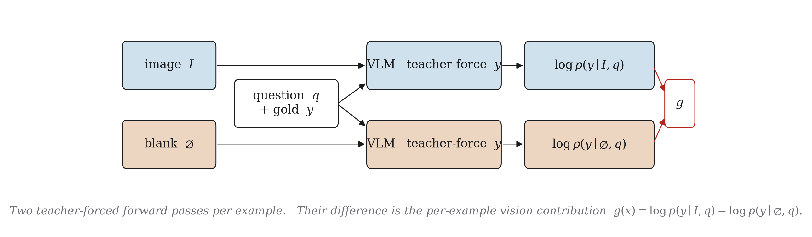
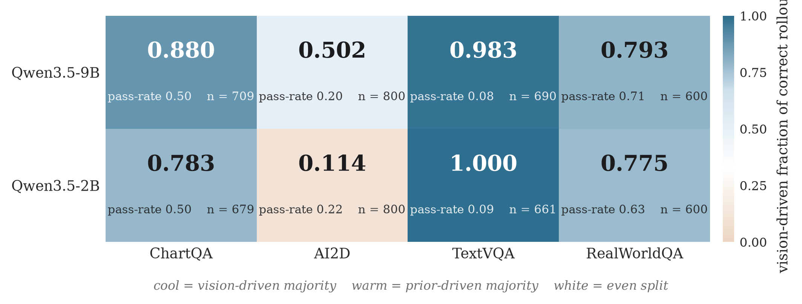
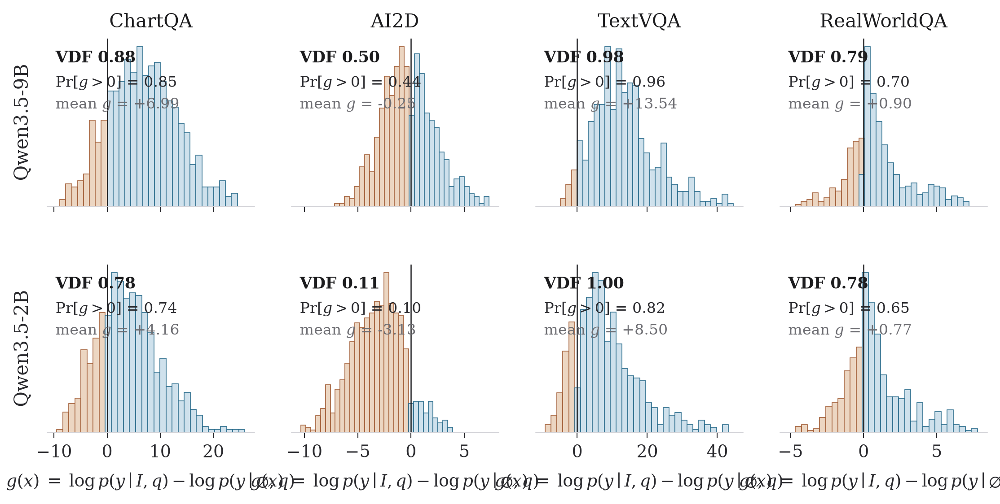
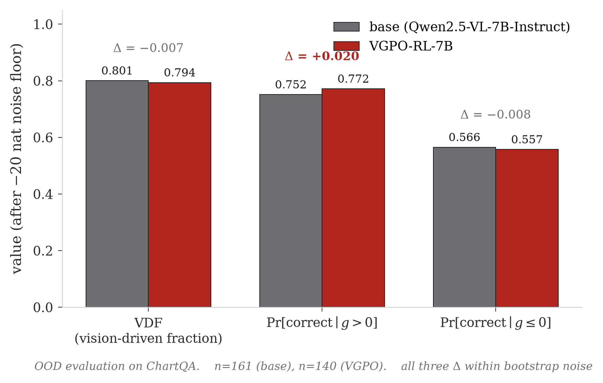

# PEAR

### Perceptual Edge Audit for RL in vision-language models

> *Measurement before optimization. One number, two forward passes,
> a public audit of a fast-moving sub-literature.*

This README is a guided tour. It walks the project end to end in five
steps: the premise we wanted to test, the measurement we built, the
result on a benchmark grid, the audit of a public method, and the
caveats. The full long-form discussion is in [REPORT.md](REPORT.md);
the code is in [pear/](pear/).


## Step 1 — The premise we wanted to test

Through 2025 and 2026 a new *perception-aware* RL algorithm for
vision-language models appeared roughly every six weeks — PAPO, VPPO,
PGPO, PRPO, Vision-SR1, SRPO, PDCR, PEPO, VGPO, Perceval. They differ
in detail, but they all open with the same sentence:

> *VLMs underperform on visual reasoning because their policies are not
> sufficiently grounded in the image; the fix is a training objective
> that rewards image-conditional behaviour.*

That premise has driven a lot of work. Almost no one tested it. The
question we wanted answered, before optimising for it, is the obvious
one:

> *Of all the correct answers a modern VLM produces on a standard VQA
> benchmark, what fraction actually depended on the image?*

That number — the share of model successes that can be attributed to
seeing rather than guessing — is the deliverable of this project.


## Step 2 — The measurement we built

For an example $x = (\text{image},\, q,\, \text{gold})$, score the gold
answer twice under teacher forcing: once with the real image, once with
a uniform-grey blank of the same dimensions. Their difference is the
influence of the pixels on the answer, isolated from sampling noise
and from anything else the model knows.

```
g(x)  =  log p(gold | image, q)  −  log p(gold | blank, q)
```

If `g(x) > 0` the image moved belief toward the gold answer — the
example is **vision-driven**. If `g(x) ≤ 0` the model already preferred
the gold answer from the question alone — the example is
**prior-driven**. Aggregated across a benchmark, the headline number
is the **vision-driven fraction of correct rollouts**:

```
VDF  =  (mass of correct rollouts on examples with g > 0)
        ─────────────────────────────────────────────────
        (mass of correct rollouts on all examples)
```

VDF is a *win-mass* quantity: of all the correct answers the model
produces, what fraction come from examples where seeing actually
helped. The remaining `1 − VDF` is win-mass from examples a uniform
grounding regularizer cannot move.

That is the entire signal. Two forward passes per example.



### Names used in this repository

| name | role | where it lives |
| :--- | :--- | :--- |
| **PEAR** | the project, the Python package, and this repository (*Perceptual Edge Audit for RL*) | `pear/`, the repo root |
| **VEST** | the diagnostic procedure PEAR implements (*Vision-vs-prior Equity Score Test*) | [pear/vest.py](pear/vest.py) and [pear/score.py](pear/score.py) |
| **VDF** | the single headline number VEST produces per (model, benchmark) cell | every result table below |
| `g(x)` | the per-example score VEST computes | the `g` column of every probe parquet |

| | |
| :--- | :--- |
| **Cost per example** | About a second on an H100 (two teacher-forced forward passes). |
| **Cost per benchmark** | 15–60 minutes on a single 80 GB GPU. |
| **What it requires** | A model, a benchmark, gold answers. No auxiliary classifier, no teacher model, no training. |

---

## Step 3 — What VEST found on the grid (E1)

We ran VEST across a Cartesian grid of two model scales and four
public VQA benchmarks:

> `{Qwen3.5-2B, Qwen3.5-9B} × {ChartQA, AI2D, TextVQA, RealWorldQA}`
>
> Eight cells. 800 examples drawn per cell (600 for RealWorldQA, which
> has 765 total). After the conservative noise floor on numerically
> unreliable rows, between 600 and 800 examples per cell are retained.

The **VDF** values:

|                 |  ChartQA  |   AI2D    |  TextVQA  | RealWorldQA |
| :-------------- | --------: | --------: | --------: | ----------: |
| **Qwen3.5-9B**  | **0.880** | **0.502** | **0.983** |   **0.793** |
| **Qwen3.5-2B**  | **0.783** | **0.114** | **1.000** |   **0.775** |



Three things to notice, in order:

1. **The spread is nearly nine-fold** — from 0.114 to 1.000. A single
   per-cell number conceals an order of magnitude of variation.

2. **The ordering is backwards from the perception-aware framing.**
   AI2D, the lowest cell, is multiple-choice diagram reasoning — the
   benchmark closest to *the model just guesses from the options*.
   TextVQA, the highest cell, is *read the text rendered into the
   image* — the benchmark with the least possible language-prior
   shortcut. The framing predicts the opposite ordering.

3. **Three of the four benchmarks already produce most of their
   correct rollouts from vision-driven examples** — even at 2B. A
   grounding regularizer applied uniformly cannot move the
   vision-driven majority that already exists; it can only act on
   the prior-driven minority, which on most benchmarks is small.

The per-example detail tells the same story:



> **Plain reading.** The perception-bottleneck premise is
> *benchmark-specific*. It is empirically backwards on three of the four
> benchmarks we tested, and only describes the world on
> multiple-choice diagram QA at small scale.

The full per-cell discussion — including the limitation that TextVQA's
0.98+ number is dominated by a tiny absolute numerator — is in
[REPORT.md §6](REPORT.md#6-experiment-e1--the-grid).


## Step 4 — What VEST found on the one public method (E3)

Of the ten perception-aware RL methods listed in Step 1, **exactly one
has released model weights publicly**: VGPO
(`MuMing0102/VGPO-RL-7B`). VGPO is trained from Qwen2.5-VL-7B-Instruct,
so the before/after audit must use that base. We probed both on
ChartQA:

| metric                          | base 7B | VGPO-RL-7B |           Δ |
| :------------------------------ | ------: | ---------: | ----------: |
| **vision-driven fraction (VDF)**|   0.801 |      0.794 |      −0.007 |
| Pr[correct \| g > 0]            |   0.752 |      0.772 |      +0.020 |
| Pr[correct \| g ≤ 0]            |   0.566 |      0.557 |      −0.009 |
| Spearman ρ(g, pass-rate)        |  +0.194 |     +0.194 |       0.000 |
| n (after −20 nat noise floor)   |     161 |        140 |           — |



On out-of-distribution ChartQA, the VGPO objective did not measurably
shift VDF — the metric the paper's framing predicts should move the
most. The Spearman correlation of `g` with downstream correctness is
unchanged to three decimal places.

We are careful not to over-read this:

- ChartQA is *not* the VGPO training distribution.
- The sample sizes after the noise floor (161, 140) are modest.
- The Δ values are within the bootstrap noise envelope.

But the measurement this comparison requires has not previously been
reported by VGPO or by any sister paper. As more checkpoints become
public, the same audit script extends to them.

### Why two model families?

The grid uses Qwen3.5, the audit uses Qwen2.5-VL. They are not mixed,
and each pairing is strict within-family:

|                      | grid (E1)                                  | audit (E3)                                          |
| :------------------- | :----------------------------------------- | :-------------------------------------------------- |
| **Question asked**   | Is the perception-aware premise true?      | Did this perception-aware method change it?         |
| **Model**            | Qwen3.5-2B and Qwen3.5-9B                  | Qwen2.5-VL-7B-Instruct and VGPO-RL-7B               |
| **Why this model**   | Newest open dense unified-VL family        | Only base on which a public perception-aware checkpoint exists |
| **What's the pair**  | Two scales of the same family              | A base model and its tuned descendant               |

If a perception-aware checkpoint were released on a Qwen3 backbone, E3
would use it. None has been.

---

## Step 5 — What this work is, and is not

It **is** a measurement instrument and a public audit. One number,
well-defined, cheap to compute, reproducible from the files in this
repository — and that number disagrees substantially with the premise
of an entire sub-literature.

It **is not** a new RL algorithm. We deliberately did not propose
*VEST-GRPO* or a partitioned policy or any other method, because the
measurement is the contribution. The natural follow-ups — **E2**
(in-training VEST tracks under vanilla GRPO) and **E4** (a policy that
routes prior-driven examples through one objective and vision-driven
through another) — are described in
[REPORT.md §11](REPORT.md#11-open-questions-and-next-steps-e2-and-e4)
as the obvious next experiments once VEST is established as a default
diagnostic.

A focused list of seven explicit threats to validity is in
[REPORT.md §9](REPORT.md#9-limitations-threats-to-validity-and-what-would-change-the-picture).

---

## How to read the rest

| if you want to... | go to |
| :--- | :--- |
| Read the full chain of thought, including the eight prior iterations that led to VEST | [REPORT.md](REPORT.md) |
| Re-run a single cell or the whole grid | [Quickstart](#quickstart) below |
| Inspect any reported number row by row | [results/probes/](results/probes/) (ten committed parquets) |
| Regenerate every figure from those parquets | `python scripts/make_figures.py` |
| Read the seven explicit limitations | [REPORT.md §9](REPORT.md#9-limitations-threats-to-validity-and-what-would-change-the-picture) |
| Browse the eight-iteration research history | [archive/README.md](archive/README.md) |

---

## Repository layout

```
PEAR/
  pear/                       the package
    config.py                   tunable knobs (image sizes, generation params)
    model.py                    AutoModelForImageTextToText loader
    data.py                     loaders: chartqa, ai2d, textvqa, realworldqa
    verifiers.py                answer verification (mc, numeric, exact, anls)
    score.py                    teacher-forced log-prob (sum + mean), sampling
    vest.py                     the decomposer; this is the central instrument
    probe.py                    per-(model, dataset) driver writing one parquet
    audit.py                    cross-checkpoint VEST roll-up
    cli.py                      python -m pear {probe, decompose, audit, smoke}

  scripts/
    run_e1_grid.sh              the 8-cell E1 chained probe runner
    run_e3_audit.sh             the base-vs-VGPO probe runner
    make_figures.py             reproduces every figure in REPORT.md

  results/
    probes/                     ten .parquet files, one per cell, all committed
    vest/                       per-cell VEST text dumps
    audits/                     E1 grid + E3 contrast as .csv and .txt
    figures/                    every figure as .pdf and .png

  archive/                      the eight-iteration research history that led
                                to VEST: pear1/ .. pear6/ and seeing/, kept
                                verbatim (see archive/README.md)

  REPORT.md                     full narrative report with chain of thought
  README.md                     this file
```

---

## Quickstart

```bash
git clone git@github.com:Bechirdardouri/PEAR.git
cd PEAR

# 1. environment (single H100 or any 80 GB device; bf16, flash-attn optional)
python -m venv .venv && source .venv/bin/activate
pip install -r requirements.txt

# 2. sanity check (synthetic, ~2 seconds, runs on CPU)
python -m pear smoke

# 3. reproduce one cell of the grid (~50 minutes on H100)
python -m pear probe \
    --model-id Qwen/Qwen3.5-9B --source chartqa --n-per-source 800 \
    --out results/probes/probe_qwen35_9b_chartqa.parquet

# 4. run VEST on it
python -m pear decompose \
    --parquet results/probes/probe_qwen35_9b_chartqa.parquet \
    --group-by-source

# 5. compare two checkpoints (the E3 audit)
python -m pear audit \
    --entry base:results/probes/probe_qwen25vl_7b_base_chartqa.parquet \
    --entry vgpo:results/probes/probe_qwen25vl_7b_vgpo_chartqa.parquet \
    --out results/audits/audit_e3_vgpo_chartqa.csv

# 6. regenerate every figure
python scripts/make_figures.py
```

All ten probe parquets used in the report are committed under
[results/probes/](results/probes/), so any number, table, or figure can
be regenerated without re-running a single forward pass:

```bash
python scripts/make_figures.py
python -m pear decompose --parquet results/probes/probe_qwen35_2b_ai2d.parquet
```

End-to-end chained reproduction of the grid and the audit, on one H100:

```bash
bash scripts/run_e1_grid.sh        # ~5 hours wall time
bash scripts/run_e3_audit.sh       # ~2 hours wall time
```

---

## License

MIT. See [LICENSE](LICENSE).
