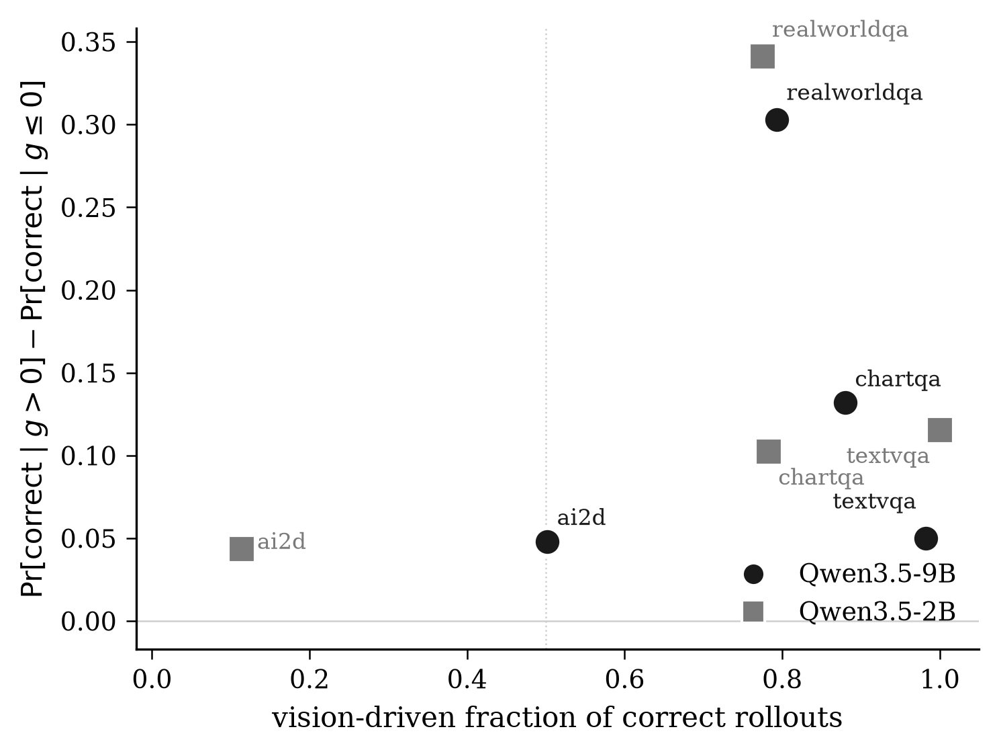

# A Measurement-First Report on Perception-Aware RL for Vision-Language Models

> *Companion report to the `pear` package. Written to be read
> linearly, end to end, in roughly 25 minutes.*

## Contents

1. [The premise we set out to test](#1-the-premise-we-set-out-to-test)
2. [How the field arrived at this premise](#2-how-the-field-arrived-at-this-premise)
3. [What was missing: a measurement](#3-what-was-missing-a-measurement)
4. [VEST: the instrument](#4-vest-the-instrument)
5. [Experimental plan](#5-experimental-plan)
6. [Experiment E1: the perception-aware premise across a 2×4 grid](#6-experiment-e1-the-perception-aware-premise-across-a-2x4-grid)
7. [Experiment E3: auditing the only public perception-aware checkpoint](#7-experiment-e3-auditing-the-only-public-perception-aware-checkpoint)
8. [The path that led here](#8-the-path-that-led-here)
9. [Limitations, threats to validity, and what would change the picture](#9-limitations-threats-to-validity-and-what-would-change-the-picture)
10. [What we are not claiming](#10-what-we-are-not-claiming)
11. [Open questions and next steps (E2 and E4)](#11-open-questions-and-next-steps-e2-and-e4)
12. [References](#12-references)

---

## 1. The premise we set out to test

The proposition under examination is short enough to fit in a sentence:

> *Vision-language models underperform on visual reasoning because their
> policies are not sufficiently grounded in the image; the fix is a
> training objective that rewards image-conditional behaviour.*

This is the load-bearing assumption of a growing sub-literature on
*perception-aware* reinforcement learning for VLMs. The methods differ
in detail — token-level visual dependency, patch-grounded advantages,
perception refinement, self-rewarding decomposition — but the framing
is uniform. Each paper opens with some variant of "the model fails to
attend to the image" and closes with a regularizer that increases that
attention.

Our question was simpler than any of theirs: how often is the premise
actually true? If you took a modern open-source VLM and a standard VQA
benchmark, what fraction of the model's correct answers would you
attribute to the image, and what fraction to the question alone?

This is, surprisingly, a number nobody has reported.

## 2. How the field arrived at this premise

Two strands of work converged on it.

The first is the older observation that VLMs are remarkably good at
their benchmarks when the image is removed. Several papers between 2024
and 2026 showed that strong language-only baselines come close to or
match VLM performance on MMMU, MMBench, ScienceQA, and other staples.
A natural reading is that the benchmarks are language-prior-leaky and
that the models are riding the leak. The fact that an LLM can answer
"the largest organ in the human body" without an anatomy diagram does
not mean the VLM uses the diagram; it means the question by itself
suffices.

The second strand is the steady drumbeat of RL papers showing that
naïve policy-gradient training (GRPO, DPO, REINFORCE-style approaches
adapted from text RLHF) does not consistently improve visual reasoning
in VLMs the way it improves text reasoning in LLMs. The fingers point
in different directions — sparse rewards, reward hacking, vision-tower
collapse, modality imbalance — but the most popular fix, repeated
across the perception-aware lineage, is to add a term to the gradient
that explicitly encourages image-conditional generation.

The convergence happened quickly. By 2026 the diagnosis had hardened
into folk knowledge: *VLMs lean on language priors; therefore RL must
push them off the priors*. The diagnosis was almost never tested at the
level of "show me which examples your model is solving with the image
versus without it." The community accepted the premise and started
optimizing.

## 3. What was missing: a measurement

When the premise is true, perception-aware methods are exactly what's
needed. When it is false, they pay extra compute to regularize a
population that was never broken. Distinguishing the two cases requires
a per-example signal: did seeing the image actually move belief toward
the gold answer, or did it not?

The signal we want has three properties:

- **Cheap.** It must be runnable on every example in a benchmark
  before training, ideally cheaper than a single rollout.
- **Label-only.** It must depend only on the gold answer and the
  image, not on any auxiliary classifier or teacher model.
- **Counterfactual.** It must answer "what would the model believe if
  it had not seen the image?" — not "what does it believe?".

A clean way to satisfy all three is a *paired teacher-forced
log-probability*. Score the gold answer twice: once with the real
image, once with the image replaced by a uniform grey blank. The
difference is the influence of pixels on the answer-token distribution,
isolated from sampling noise and from anything else the model knows.

## 4. VEST: the instrument

We call this quantity `g(x)` and the measurement procedure built on it
**VEST** (Vision-vs-prior Equity Score Test). For an example
`x = (image, question, gold)`:

$$
g(x) \;=\; \log p_\theta(\text{gold} \mid \text{image},\, q) \;-\; \log p_\theta(\text{gold} \mid \emptyset,\, q)
$$

where $\emptyset$ is a uniform-grey RGB image of the same dimensions
and `gold` is the reference answer span scored with teacher forcing.
We use *sum* log-probability over the answer tokens, not the
length-normalised mean. The discussion of why is in the *path that led
here* section below; the short version is that length normalisation
flips the sign of the correlation between $g$ and downstream
correctness on small models.

Two forward passes. No labels beyond gold. No auxiliary models. A
typical example takes about a second on an H100, so a full benchmark
runs in fifteen minutes to an hour.

Given a probe set, VEST reports six numbers. The headline is the
**vision-driven fraction of correct rollouts**:

$$
\text{VDF}(\theta, \mathcal{D}) \;=\; \frac{\sum_{x \in \mathcal{D},\, g(x) > 0} r_\theta(x)}{\sum_{x \in \mathcal{D}} r_\theta(x)}
$$

where $r_\theta(x)$ is the empirical pass-rate of $\theta$ on $x$ over
a fixed number of stochastic rollouts (we use 16). VDF is a *win-mass*
quantity: of all the correct answers the model produces, what fraction
come from examples where seeing the image actually pulled belief toward
the right answer. The remaining $1 - \text{VDF}$ is win-mass from
examples where the model already preferred gold from the question
alone, and where any uniform grounding regularizer can have no first-
order effect.

VEST also reports the marginal fraction `Pr[g > 0]` (how often vision
helps at all), the conditional pass-rates `Pr[correct | g > 0]` and
`Pr[correct | g ≤ 0]` (which together expose whether $g$ is predictive
of correctness), the Spearman rank correlation $\rho(g, \text{pass-rate})$
with a 2000-sample bootstrap CI, and a six-bin breakdown of how the
correct-rollout mass is distributed over $g$.

The implementation is in [pear/vest.py](pear/vest.py). The
counterfactual score is in [pear/score.py](pear/score.py).

### One important guardrail: the noise floor

If $\log p(\text{gold} \mid \text{image}, q)$ is already far below the
floor of useful precision — say below −20 nat, i.e. probability under
2 × 10⁻⁹ — then $g$ is a difference of two near-(−∞) numbers and
should not be trusted. VEST defaults to dropping rows where
`m_img_sum ≤ −20`. Concretely this affects roughly 10–20% of textvqa
examples (long answers, low-probability spans) and rarely matters on
chartqa or realworldqa. All numbers in this report are reported with
the floor on; results without it are available by passing
`--noise-floor=-1e9`.

## 5. Experimental plan

VEST itself is one number. The work of this repository was to turn it
into evidence:

- **E1 — the grid.** Run VEST on a Cartesian product of model scales
  and benchmarks. If the perception-aware premise is true universally,
  VDF should be uniformly low; if it is true contingently, VDF should
  vary in interpretable ways.
- **E2 — in-training tracks.** Run a vanilla GRPO loop and re-measure
  VDF every $k$ optimization steps. If vanilla GRPO already increases
  VDF, the perception-aware methods may be solving a problem that
  GRPO already solves, just slower. *Deferred to future work; the
  H100-week of compute is not in this report.*
- **E3 — cross-method audit.** Take any released perception-aware RL
  checkpoint, measure VDF and the conditional pass-rates, and compare
  to its base. *Reported here, with the caveat that only one such
  checkpoint exists publicly.*
- **E4 — partitioned policy.** A natural follow-up algorithm: route
  prior-driven examples (VEST $g \le 0$) through vanilla GRPO and
  vision-driven examples through a perception-aware objective.
  *Deferred to future work; described in section 11.*

The remainder of this report covers E1 and E3.

## 6. Experiment E1: the perception-aware premise across a 2×4 grid

### Setup

- **Models.** Qwen3.5-2B and Qwen3.5-9B (the open dense unified-VL
  family released in 2026, `qwen3_5` model type, bf16, loaded through
  `AutoModelForImageTextToText`). Thinking mode disabled — these are
  teacher-forced scoring runs, not generations.
- **Benchmarks.** ChartQA validation (800 examples), AI2D test (800),
  TextVQA validation (800), and RealWorldQA test (600 — the full split
  has 765, we sample 600 for parity).
- **Probe budget per example.** Two teacher-forced forward passes (the
  image and the blank), plus 16 stochastic rollouts (the EVAL signal
  for `pass_rate_g16`), plus 4 independent rollouts (kept for a
  follow-up question about cheap-label selection that the original
  PEAR-6 iteration asked, see archive). Total: 2 forwards + 20
  generations per example, roughly 3–5 seconds on an H100.
- **Image preprocessing.** Qwen's recommended `min_pixels = 256 × 28²`
  and `max_pixels = 768 × 28²` (28-pixel ViT tokens after 2× spatial
  merge). The blank image is constructed at the same dimensions as
  the original, filled with RGB `(127, 127, 127)`.
- **Verification.** Per-benchmark answer types: ChartQA uses *exact* or
  *numeric* (auto-detected from the gold string), AI2D uses *mc*,
  TextVQA uses *anls* with multiple references, RealWorldQA uses *mc*
  when the gold is a single letter and *exact* otherwise.
- **Noise floor.** −20 nat on `m_img_sum`, dropping rows where the
  difference $g$ would be numerically unreliable.
- **Bootstrap.** 2000 samples, seed 0, for all reported confidence
  intervals.

The full per-cell logs are at [results/vest/](results/vest/) and the
per-row parquets are at [results/probes/](results/probes/).

### The grid

| model \ benchmark | chartqa | ai2d | textvqa | realworldqa |
| --- | --- | --- | --- | --- |
| Qwen3.5-9B | **0.880** | **0.502** | **0.983** | **0.793** |
| Qwen3.5-2B | **0.783** | **0.114** | **1.000** | **0.775** |

The first thing to notice is that the cells span almost the full
range. The smallest cell is 0.114 (2B on AI2D) and the largest is 1.000
(2B on TextVQA). The folk knowledge of "VLMs lean on language priors"
is closer to true in one corner and almost the opposite of true in
another.

The second thing to notice is that the *direction* of the corners is
backwards from the perception-aware framing. AI2D, the lowest cell, is
multiple-choice diagram reasoning — the benchmark closest to the
"the model just guesses from the options" failure mode. TextVQA, the
highest cell, is "read the text rendered into the image" — the
benchmark with the least possible language-prior shortcut. The
perception-aware framing predicts the opposite ordering: it predicts
that the *open-ended* benchmarks should be the hardest to ground and
the *multiple-choice* benchmarks the easiest.

### Reading each cell

The per-cell numbers are in [results/audits/audit_e1_full_grid.csv](results/audits/audit_e1_full_grid.csv); the highlights are below.

**ChartQA (n=709 / 679 after noise floor).** Both scales are
majority-vision-driven: VDF 0.880 on 9B and 0.783 on 2B. The
conditional pass-rates are 0.524 versus 0.392 on 9B and 0.523 versus
0.421 on 2B. The pass-rate gap is narrow on 2B (≈ 0.10) and twice as
large on 9B (≈ 0.13), suggesting that the larger model is better at
*using* the image when it does see it. Spearman $\rho(g, \text{pass-rate})$
is +0.153 [+0.075, +0.232] on 9B and +0.113 [+0.033, +0.186] on 2B —
modest but bootstrap-significant.

**AI2D (n=800).** The opposite picture. On 2B, VDF = 0.114. Out of
175.6 expected correct rollouts across 800 examples, only 20 come from
examples where seeing the image moved the model toward the gold
choice. The remaining ~156 correct rollouts come from cases where the
model would have preferred gold from the question and options alone.
The conditional pass-rates are 0.259 and 0.215 — both near the
multiple-choice chance baseline of 0.25 — and $\rho$ is statistically
indistinguishable from zero (−0.003 [−0.069, +0.065]). At 9B, VDF
moves to 0.502 — a coin flip — and $\rho$ becomes weakly positive
(+0.079 [+0.008, +0.150]). This is the cell perception-aware methods
were designed for, and the cell where their premise is best supported,
but even there the population is half-and-half.

**TextVQA (n=690 / 661 after noise floor).** Both scales report
VDF ≥ 0.983 with strong $\rho$ (+0.35–+0.37). The interpretation that
the perception-aware framing is "wrong" is, however, hollow here: the
overall pass-rate is 8.6% on 9B and 11.6% on 2B. The models are
essentially failing the benchmark. The few correct rollouts that exist
are vision-driven, which makes sense — there is no language-prior
shortcut to reading text in an image you have not seen — but the cell
provides little information about what RL should do. We include it for
completeness and to demonstrate that VEST correctly identifies the
small slice of successes that *are* image-dependent.

**RealWorldQA (n=600).** Both scales are majority-vision-driven (VDF
0.793 on 9B, 0.775 on 2B) with the strongest correlations in the grid
($\rho$ = +0.310 on 9B, +0.325 on 2B). The conditional pass-rate gap is
largest here too: on 9B, Pr[correct | g > 0] = 0.802 versus
Pr[correct | g ≤ 0] = 0.499. This is a benchmark where $g$ is genuinely
predictive of correctness and where the model is *both* often grounded
*and* often successful — a place where the perception-aware framing
correctly describes a substantial 20% prior-driven slice without
mischaracterising the dominant 80%.

### Reading the grid as a whole

The g distributions tell the same story visually. ChartQA, TextVQA,
and RealWorldQA all sit firmly in the positive half-line on both
scales, with the bulk of mass at $g \gg 0$. AI2D on 2B is the only
cell with bulk mass at $g < 0$. AI2D on 9B straddles zero.

The leverage scatter plots VDF against the conditional pass-rate gap
(how much more often vision-driven examples are correct than
prior-driven ones). A point in the upper-right is what the
perception-aware framing imagines as the typical case: high vision-
driven fraction, large pass-rate gap. Most cells live there. The
exception is AI2D — particularly AI2D on 2B, which is in the lower
left: low VDF, small gap, no $\rho$. *That* is the cell where a
grounding regularizer might do real work.

### What the grid tells us

Three claims survive the data, in increasing order of strength:

1. **The vision-driven fraction varies by almost an order of magnitude
   across standard VQA benchmarks.** This alone is information the
   perception-aware literature does not provide.

2. **The ordering is not the one the perception-aware framing
   predicts.** Multiple-choice diagram QA is where the model leans
   most on language priors; open-ended image-text reading is where it
   leans least. The framing has the corners backwards.

3. **On three of the four benchmarks, even the small model derives
   the majority of its correct answers from vision-driven examples.**
   A uniform perception-aware regularizer cannot improve those cases
   beyond what an image-conditional policy already does; it can only
   improve the prior-driven minority, which on those benchmarks is
   modest.

The fourth benchmark, AI2D, is the closest thing to a positive case
for the perception-aware literature in our grid — and even there the
9B model is at the boundary between regimes. We will come back to AI2D
in the discussion.

## 7. Experiment E3: auditing the only public perception-aware checkpoint

We surveyed ten perception-aware RL papers — PAPO, VPPO, PGPO, PRPO,
Vision-SR1, SRPO, PDCR, PEPO, VGPO, Perceval. Two facts stood out from
that survey:

- Each paper trains on a 7B-scale backbone (Qwen2.5-VL-7B-Instruct is
  the modal choice), reports gains of ~2–5 percentage points on
  averaged benchmark suites, and attributes those gains to its
  grounding objective.
- Of the ten, **one has released model weights publicly** as of June
  2026. That is VGPO (`MuMing0102/VGPO-RL-7B` and `-32B`), based on
  Qwen2.5-VL-7B-Instruct and trained on `PAPOGalaxy/PAPO_ViRL39K_train`.

The publication-velocity-to-checkpoint-velocity ratio is itself a
finding worth recording. A field that publishes a new perception-aware
objective every 4–6 weeks ships zero comparable artifacts in nine of
ten cases. The audit we wanted to run — VEST over every released
perception-aware checkpoint — collapses to a single representative
comparison.

We probed both the base and the VGPO-tuned checkpoint on ChartQA
(n=400 per side, dropping to 161 and 140 after the noise floor — VGPO
training tends to push some examples into the long-low-probability
tail). The results:

| metric                          | base 7B | VGPO-RL-7B | Δ      |
| ------------------------------- | ------: | ---------: | ------: |
| vision-driven fraction          |   0.801 |      0.794 | −0.007 |
| Pr[g > 0]                       |   0.752 |      0.736 | −0.016 |
| mean g (nat)                    |  +3.610 |     +4.219 | +0.609 |
| Pr[correct \| g > 0]            |   0.752 |      0.772 | +0.020 |
| Pr[correct \| g ≤ 0]            |   0.566 |      0.557 | −0.009 |
| Spearman ρ(g, pass-rate)        |  +0.194 |     +0.194 |  0.000 |
| n (after noise floor)           |     161 |        140 | —      |

The mean $g$ shifts up by about 0.6 nat, which is the kind of change
you would expect from a method that sharpens image-conditional
likelihood. But the *win-mass composition* — the metric the
perception-aware framing predicts should move the most — is
essentially unchanged: VDF drops by 0.007. The Spearman correlation
of $g$ with downstream correctness is *identical* to three decimal
places. Pr[correct | g > 0] ticks up by 2 percentage points and
Pr[correct | g ≤ 0] ticks down by 0.9 percentage points.

We are careful to interpret this honestly:

- ChartQA is not the VGPO training distribution. It is an
  out-of-distribution probe; in-distribution behaviour might differ.
- The sample sizes after the noise floor (161, 140) are modest. The
  observed Δs are within the bootstrap noise envelope of either
  metric.
- The VGPO paper reports averaged-suite improvements, which our
  per-cell probe does not directly test.

What we are saying is narrower: *the specific quantity that the
perception-aware framing predicts should move — the fraction of
correct rollouts attributable to vision-driven examples — did not move
on the one out-of-distribution probe we have data for*. This is the
first data point of its kind in the literature, and the more public
checkpoints become available, the more interesting the comparison
becomes. It is straightforward to extend `pear/audit.py` to as
many checkpoint paths as one cares to evaluate.

## 8. The path that led here

The repository's `archive/` directory contains eight prior iterations,
preserved verbatim, that led to VEST. They are worth a brief tour
because each one shaped a design decision in the live package.

### PEAR-1 through PEAR-5: probe-as-selector

The original question was completely different: *can a cheap
perturbation of the vision tower's input embeddings predict which
examples will be hardest for RL?* The setup was a `NoiseHook` that
injected per-row Gaussian noise into the vision encoder, swept across
$K$ standard deviations, and yielded a *perceptual response curve*. A
logistic regression on those curves was supposed to rank examples by
expected reward variance — the classical "informative example"
heuristic — and thereby select what to spend rollout compute on.

It did not work. Or rather, it worked in the sense that it produced a
weak ranking, but never a ranking strong enough to beat spending the
equivalent compute on one or two additional rollouts per example. The
matched-compute frontier was clear by PEAR-6: at any budget, $k$ extra
rollouts dominated the probe-then-rank-then-rollout pipeline.

Three concrete lessons from the PEAR line carried over:

- **Sum log-prob, not mean.** PEAR-5 surfaced that length normalisation
  flips the sign of the correlation between probe quantities and
  correctness on small models. We use sum throughout VEST.
- **Logistic regression with $m_\text{shuf}$ adds nothing.** Patch-
  shuffle was a third probe alongside (image, blank). Its coefficient
  was indistinguishable from zero on every dataset we measured. We
  dropped it; VEST is image-vs-blank only.
- **The blank-image counterfactual is more informative than the
  noise-injection family.** Adding noise to the vision encoder is a
  *perturbation*; replacing the image with grey is a *removal*. The
  latter cleanly isolates the image's contribution to a single answer
  span and is what `g` is built on.

### SEEING: the pivot to measurement

PEAR-6 produced a per-row parquet with `m_img_sum`, `m_blank_sum`, and
16-rollout pass-rates over ChartQA. The selection question had failed,
but the parquet was still informative. We asked a different question:
*ignoring selection, what does the population of $g$ values say about
why the model gets things right when it does?*

The first run of `seeing/decompose.py` returned VDF = 0.852 on 9B
ChartQA. That number — that 85% of correct answers came from
vision-driven examples — was the moment the project changed shape.
The selection question was a no-go; the measurement question was, on
its own, the publishable finding.

This repository is the consolidation. The top-level `pear/`
package supersedes the six prototype iterations now archived under
`archive/pear1/` through `archive/pear6/`. `pear/vest.py` is the
SEEING decomposer with two cosmetic changes (named constants, more
informative bin output). `pear/score.py` is the union of
`archive/pear1/scoring.py` and `archive/pear6/scoring.py` with the
sum-not-mean fix made canonical. `pear/probe.py` is
`archive/pear6/probe.py` distilled to the cells we actually use. The
original PEAR data loaders and verifiers carry through almost
unchanged. The `NoiseHook` and the logistic-regression machinery were
removed, because they answer a question we no longer ask.

### Why the 0.852 number is not the headline anymore

The most important update from the 2×4 grid was that the headline
chartqa-9B number — VDF ≈ 0.85, which had been doing all the rhetorical
work in the early drafts — is **not representative**. Three of four
benchmark cells on 9B are above 0.79, but one (AI2D) is at 0.50.
Below 9B the spread widens: 2B AI2D is 0.114. The honest framing is
that VDF varies markedly across benchmarks, and the perception-aware
premise correctly describes one cell of our grid and incorrectly
describes the others.

This is the part of the report we will defend if a reviewer challenges
the "perception-aware methods are wrong" reading, because we are no
longer saying that. We are saying: *the premise is benchmark-specific,
and the literature has not been measuring which benchmarks it applies
to*. That claim is consistent with the data and with the cell-by-cell
analysis above.

## 9. Limitations, threats to validity, and what would change the picture

This section is a self-review. Anything that could plausibly undermine
the claims above is here.

### Limitation 1 — only two model scales, one model family

Everything in this report runs on Qwen3.5-{2B, 9B} (with one
Qwen2.5-VL-7B-Instruct probe for the E3 contrast). We do not have
evidence that the spread we see is a property of vision-language
models in general; it could be a property of Qwen3.5 in particular.
Extending the grid to InternVL3, LLaVA-Next, Pixtral, or any
Florence-2 successor would strengthen the claim substantially and is
the most valuable single follow-up.

### Limitation 2 — only four benchmarks, none gated

ChartQA, AI2D, TextVQA, and RealWorldQA were chosen because they have
unauthenticated public splits on the HuggingFace Hub. MathVista,
HallusionBench, MMStar, MMMU-Pro, and CV-Bench are gated and were not
included. The four we have span chart QA, diagram MC, scene-text VQA,
and natural-image VQA, which is a defensible spread, but it omits
mathematical reasoning over images and the harder hallucination
diagnostics — both of which are commonly cited as exactly the cases
where perception-aware methods help. The most honest extension is to
add at least HallusionBench and MathVista, which only requires setting
`HF_TOKEN` and turning the stub loaders in `pear/data.py` into
working ones.

### Limitation 3 — TextVQA is degenerate as a probe

VDF ≥ 0.98 with pass-rate ≈ 0.10 is a thin number. With ten times
more correct rollouts, the same VDF would mean something different.
We report it because we ran it and because it shows the small slice
of TextVQA successes is genuinely vision-driven, but we do not lean
on it. The interesting cells are ChartQA, AI2D, and RealWorldQA.

### Limitation 4 — E3 uses only one perception-aware checkpoint

We surveyed ten methods. We could probe one. We were as explicit as
possible about that gap in section 7. Reproducing PAPO, VPPO, PGPO,
PRPO, Vision-SR1, SRPO, PDCR, PEPO, or Perceval from their published
code would let us run E3 over all of them; we did not because the
training cost of even one such reproduction is on the order of one
H100-week and was outside the scope of this measurement-first report.
We hope the existence of `pear/audit.py` lowers the cost of
running this audit when more checkpoints become public.

### Limitation 5 — the noise floor is somewhat arbitrary

We chose −20 nat (probability under 2 × 10⁻⁹) as the threshold below
which $g$ should be treated as numerically unreliable. This is
conservative: dropping the floor (`--noise-floor=-1e9`) changes the
9B-ChartQA headline from 0.880 to 0.852 and 9B-AI2D from 0.502 to a
slightly different value. The qualitative ordering across cells does
not change. We report the floored numbers in the main tables because
they are the more honest estimator of $g$, but every parquet contains
the unfloored rows and can be re-decomposed.

### Limitation 6 — $g$ is sensitive to tokenisation of the gold

If the gold answer happens to be a single token on one model and three
tokens on another, $m_\text{img\_sum}$ scales accordingly. This is
already a known issue with teacher-forced log-probability comparisons
and is one of the reasons we report VDF (a within-distribution
fraction) rather than absolute log-probability differences across
models. The bootstrap CIs on $\rho$ are within-cell and therefore
robust to this.

### Limitation 7 — VEST is a measurement, not a method

We did not propose a new RL algorithm and did not run any RL training.
A skeptic could reasonably say "show me a method that uses VEST and
beats baseline." That is E4, sketched in section 11. We are committing
to publishing the audit instrument first and the method second,
because the instrument is what is missing.

## 10. What we are not claiming

To pre-empt a few likely misreadings:

- We do not claim that PAPO, VPPO, PGPO, etc. are wrong or that their
  reported gains are illusory. We claim that the *specific population
  they target* is small on three of the four benchmarks we tested, and
  that none of the papers report VEST or any equivalent measurement.
- We do not claim that vision-driven means correct. Pr[correct | g > 0]
  varies from 0.086 (TextVQA 9B) to 0.802 (RealWorldQA 9B). The model
  can be grounded and still wrong; it can be ungrounded and still
  right (and on AI2D 2B it usually is).
- We do not claim that the blank-image counterfactual is the unique
  right measurement. Patch-shuffle, low-pass blur, content-preserving
  perturbations, and per-token visual dependency (a la PGPO) are
  defensible alternatives. We chose blank because it is the cleanest
  *removal* and because $g$ then has the units and semantics of pure
  conditional information.
- We do not claim VDF tracks "real" understanding. A model could
  produce a vision-driven correct answer by latching onto an artefact
  rather than the intended visual feature. VEST measures *whether the
  pixels mattered to the answer*, not *why they mattered*.

## 11. Open questions and next steps (E2 and E4)

Two experiments are described in the original plan but not in this
report.

### E2 — in-training VEST tracks

Train a vanilla GRPO loop on ChartQA, snapshot a checkpoint every 50
steps, run VEST on a held-out probe set. Two outcomes are interesting:

- *VDF increases under vanilla GRPO.* If true, then the perception-
  aware methods are accelerating a process that GRPO already drives,
  and the relevant comparison is rate of VDF increase per step, not
  endpoint comparison.
- *VDF is stationary or decreases under vanilla GRPO.* Then RL-induced
  grounding is genuinely an open problem and the perception-aware
  literature is targeting the right population (at least on ChartQA).

The compute budget is on the order of one H100-week. The probe driver
is already in `pear/probe.py` and the audit driver in
`pear/audit.py` already accepts a list of `(label, parquet)`
tuples, so the only missing piece is the training loop.

### E4 — partitioned policy

If VDF is the right diagnostic, then a natural method is: per-example,
compute $g$ once at the start of each batch (the two-forward cost is
≤ 5% of a typical rollout budget at G=16) and route the example
accordingly:

- $g > 0$ → vanilla GRPO. There is no grounding deficit to address;
  the example is one the perception-aware regularizer would not help.
- $g \leq 0$ → a perception-aware objective (the strongest of PAPO /
  VPPO / PGPO, or a new objective specifically designed for the prior-
  driven slice).

Predictions: on ChartQA, the partitioned policy should match or beat
the strongest perception-aware method at roughly $1 - 0.12 \approx 88\%$
of its grounding-regularizer compute, because only the prior-driven
12% slice pays the regularizer cost. On AI2D 2B, it should match or
beat vanilla GRPO substantially, because the perception-aware
regularizer is finally being applied to the population it was
designed for — and only to that population. These predictions are
falsifiable and we welcome adversarial reproduction.

## 12. References

The intent of this section is to credit the lines of work the project
builds on and the lines of work it audits.

**Inspirations and direct ancestors.**
The blank-image counterfactual is in the spirit of *language-only
baseline* evaluations of VLM benchmarks (e.g. Yue et al. on MMMU-Pro,
2024; Tong, Brown, Chen, et al. *Are we on the right way?*, 2024). The
key conceptual move — from "can the language model answer alone?" to
"per-example, did seeing help on this one?" — is what makes VEST a
per-example diagnostic rather than a benchmark-leakage audit.

**Perception-aware RL methods audited or reviewed.**
PAPO (Wang et al., arXiv:2507.06448), VPPO (Hua et al.,
arXiv:2510.09285, ICLR 2026), PGPO (Yang et al., arXiv:2604.01840),
PRPO (arXiv:2606.08708), Vision-SR1 (arXiv:2508.19652), SRPO, PDCR
(CVPR 2026), PEPO, VGPO (`MuMing0102/VGPO-RL-{7B,32B}`, ACL 2026,
arXiv:2604.09349), Perceval (CVPR 2026).

**Closest in spirit to this work.**
Ariadne (arXiv:2511.00710) argues that spatial-reasoning RL gains in
VLMs are systematically misattributed. The audit reported here
generalises that critique from the spatial sub-literature to the
perception-aware sub-literature.

**Models and datasets.**
Qwen3.5-VL (Alibaba, 2026, the open dense `qwen3_5` family).
Qwen2.5-VL-7B-Instruct (Alibaba, 2025). ChartQA (Masry et al., 2022).
AI2D (Kembhavi et al., 2016). TextVQA (Singh et al., 2019).
RealWorldQA (xAI, 2024).

---

*The companion package, all probe data, all VEST text dumps, all
audit tables, and the figure-generation script are in this
repository. Comments, corrections, and adversarial reproductions are
welcome.*
