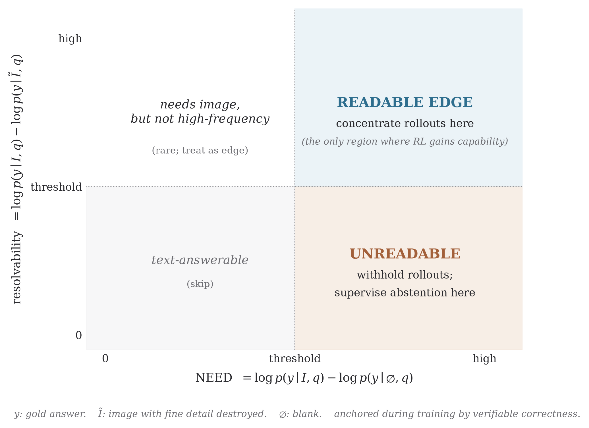
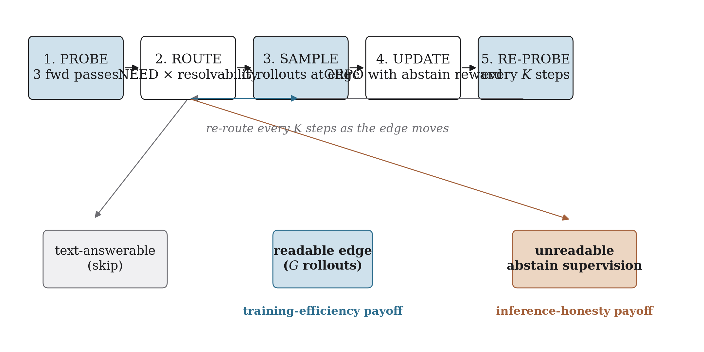
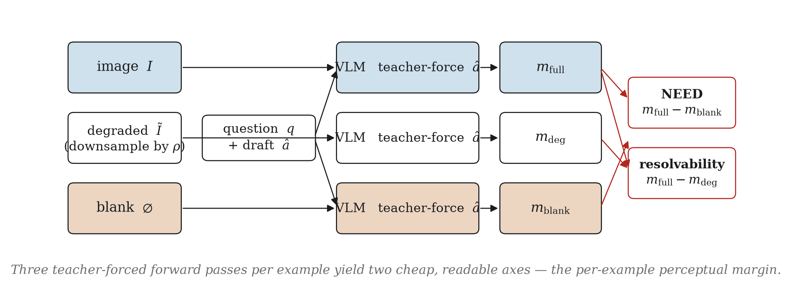
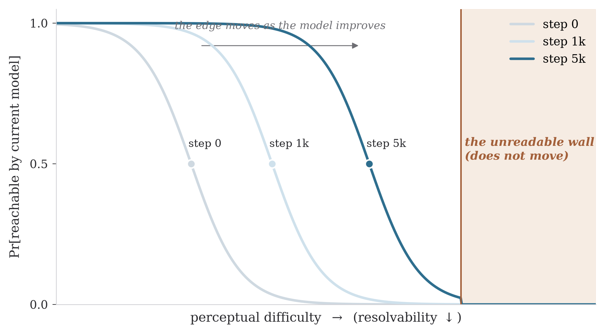

# PEAR (the method)

### Perceptual-edge curriculum and trained abstention for RL on vision-language models

> *One label-free measurement asks each example whether the image is
> needed and whether its detail is resolvable. That single signal
> concentrates RL on the part of the data where it actually helps,
> and turns the rest into supervision for an honest "I don't know."*

---

## At a glance

**The problem.** Reinforcement learning with verifiable rewards (RLVR)
has two mechanics that quietly cancel each other out on vision-language
models. When every rollout for an example is wrong, the group-relative
advantage is zero — no gradient — and dynamic-sampling methods discard
the example *after* paying to generate every rollout. On exactly those
examples the binary reward also makes confident guessing the
expected-value-maximising action, which is one of the cleanest
formal accounts of multimodal hallucination available.

**The observation.** A "wrong everywhere" group is not one failure mode
but two. The example is either **reachable-hard** — the evidence is in
the image, the model just hasn't composed the reasoning — or
**unreadable** — the evidence is not resolvable at the input the model
received. These look identical to the reward, but they demand opposite
responses: spend *more* compute, or *abstain*.

**The instrument.** A single label-free counterfactual — the
**perceptual margin** — separates them before any rollout is drawn.
It has two cheap, readable axes computed from three forward passes
over the model's own generated answer:

- **NEED**:  how much the answer depended on having any image at all.
- **Resolvability**: how much the answer depended on *fine* detail.

During training, the perceptual margin is anchored by verifiable
correctness, so a miscalibrated probe cannot mislabel an example as
unreadable when in fact the model could have solved it.

**The dual payoff, from one signal.**

1. *Training efficiency.* Replace dynamic sampling with an *a-priori*
   smooth perceptual-difficulty curriculum that allocates rollouts to
   the readable edge and withholds them from the unreadable region.
2. *Inference honesty.* Use that same unreadable region as the
   supervision for a trained **abstention action**, with the
   abstention payoff gated by perceptual sufficiency rather than
   generic confidence.

**The central falsifiable claim.** Perceptual humility learned on one
visual domain transfers to unseen ones. If it does not, this work
collapses cleanly into a calibration result; that fallback is honest
about what fails.

**What this method adds at inference.** No probe, no extra forward
pass, no teacher, no tool, no extra parameter, no extra latency. The
abstention behaviour is carried by the policy itself.



---

## Relation to the rest of this repository

This proposal is the **prescriptive** counterpart to the **diagnostic**
work already published in [REPORT.md](../REPORT.md) and summarised in
[README.md](../README.md). They share one umbrella name and one core
construct — the *perceptual edge* — but answer different questions.

| arm | object | question | status |
| :--- | :--- | :--- | :--- |
| **PEAR (audit)** | VEST → VDF | *Across cells of `{model, benchmark}`, what share of correct rollouts came from examples where the image mattered?* | shipped: `pear/`, `results/`, `REPORT.md` |
| **PEAR (method)** | perceptual margin → curriculum + abstention | *Per example, before any rollout, where does it sit on the perceptual edge — and what should the trainer do with it?* | this proposal |

The audit established that the perceptual edge exists, that it varies
by nearly an order of magnitude across benchmarks, and that the
sub-literature's framing is empirically backwards on three of four
benchmarks at small scale. The method below uses that same edge as a
*per-example* signal to allocate rollouts and supervise abstention.

The proposal here is also the explicit form of **E4** as it was
sketched in [REPORT.md §11](../REPORT.md#11-open-questions-and-next-steps-e2-and-e4).

---

## Notation

| symbol | meaning |
| :--- | :--- |
| $(I, q, a^\star)$ | image, question, gold answer |
| $\hat{a}$ | answer the policy generated for this example |
| $m_{\text{cond}}(\hat{a})$ | length-normalised log-probability of $\hat{a}$, teacher-forced, under image condition $\text{cond} \in \{\text{full},\, \text{deg},\, \text{blank}\}$ |
| $\tilde{I}$ | detail-destroyed image: $I$ downsampled by $\rho$ and bilinearly restored |
| $0$ | a uniform-grey image of the same dimensions as $I$ (the *blank*) |
| **NEED**$(x)$ | $m_{\text{full}}(\hat{a}) - m_{\text{blank}}(\hat{a})$ |
| **resolvability**$(x)$ | $m_{\text{full}}(\hat{a}) - m_{\text{deg}}(\hat{a})$ |
| $s \in [0, 1]$ | perceptual sufficiency: a normalised, clipped function of resolvability |
| $G$ | GRPO group size (number of rollouts per example) |
| pass@k | fraction of the $k$ rollouts in a group that the verifier marks correct |
| $\lambda$ | confidence penalty: reward for a wrong answer is $-\lambda$ |
| $c(s)$ | abstention payoff as a function of sufficiency; $c(s) = c_0 (1 - s)$ |

---

## 1. The problem

RL with verifiable rewards has become the default post-training stage
for vision-language models. Two of its core mechanics work against
each other.

**(i) The gradient vanishes on the examples that look most informative.**
GRPO, the dominant family, samples a group of $G$ rollouts per
$(I, q)$, scores each with a verifiable reward, and updates toward
above-average responses. When all $G$ rollouts return the same reward
— in particular when all are wrong — the within-group advantage is
zero and so is the gradient. Dynamic sampling methods such as DAPO
detect this and discard the group, but only *after* paying to generate
$G$ rollouts. AERO observes that the underlying problem is the absence
of any *a-priori measure of problem informativeness*; without one,
these methods must over-sample large batches just to find usable data.

**(ii) On exactly those examples, the reward trains hallucination.**
Kalai et al. (2025) make the incentive structure formal: a model whose
true probability of being right is $p$ scores $p \cdot 1 + (1-p) \cdot 0 = p$
by guessing and $0$ by abstaining, so outcome-only reward selects
confident guessing over honest uncertainty. For a VLM, this is one of
the cleanest accounts of multimodal hallucination: the system is
*literally being trained* to assert things it cannot see.

These two effects compound. The discarded "all wrong" examples are
where the reward most actively trains the wrong behaviour, and the
training method has no way to even ask whether they were unreachable
in principle or merely under-explored.

**The missing question, and the fork.** When the group fails, *why?*
We separate two distinct failure modes:

- **Reachable-hard**: the evidence is present in the image and the
  model could have solved the example with more exploration. This is
  the region where RLVR yields genuine capability gains
  (Zhang, Neubig & Yue, 2025) — the edge of competence, in the
  language of the learning-dynamics theory in which the policy
  gradient scales as $(\text{margin})^L$ (Huang et al., 2026).

- **Unreadable**: the evidence is not resolvable in the pixels the
  model received. The gradient is flat, no amount of additional
  sampling will recover signal, and the optimal training response is
  to *stop trying to answer it* and instead use it as supervision for
  when to abstain.

> These two regions live in the same "all wrong" bucket, but their
> training requirements are opposite. Resolving the fork before
> sampling is the contribution.

**Contributions.**

1. We reframe the zero-advantage dead zone of RLVR for VLMs as a
   *fork* between reachable-hard and unreadable, and argue from first
   principles that telling them apart is the lever for *both* training
   efficiency and inference honesty.
2. We introduce the **perceptual margin** — a single label-free
   counterfactual signal with two readable axes (NEED, resolvability)
   — that locates each example on the perceptual edge of competence
   and is *anchored* by verifiable correctness during training so a
   miscalibrated model cannot fool it.
3. We use that one signal to (i) replace post-hoc dynamic sampling
   with an *a-priori* smooth perceptual-difficulty curriculum, and
   (ii) supervise an explicit abstention action whose payoff is
   *gated by perception*, not by generic confidence.
4. We design a single-GPU experimental program whose central claim is
   transfer, with explicit kill-conditions.



---

## 2. Related work

**The edge of competence, and RLVR dynamics.**
Three results, on language models, frame everything below.
Yue et al. (NeurIPS 2025) show RLVR is bounded by the base model's
support — pass@1 sharpens, pass@k at large $k$ does not. Zhang, Neubig
& Yue (2025) refine the consequence: RL yields capability gains *only*
on the edge — problems failed at pass@1 but solved at pass@k — and
nothing on the already-solved or out-of-reach tails. Huang et al.
(2026) supply the dynamics: the policy gradient scales as
$(\text{margin})^L$, so beyond a critical difficulty the gradient is
exponentially flat, and a smooth difficulty spectrum is required to
keep training in the "relay" regime rather than long grokking
plateaus. PEAR's claim, which is what these works cannot supply, is
that for VLMs the operative difficulty axis is *perceptual* and is
*measurable per example* by a counterfactual.

**Visual grounding and perception-aware RL.**
A dense line of work rewards reliance on the image: Vision-SR1, MIRL,
VA-OPD, PAPO, and a series of perception-aware RL variants released
through 2025 and 2026. The closest two recent works are *Visual
Information Gain* (VIG, 2026), which uses a counterfactual perplexity
gain to *select* training samples for supervised fine-tuning, and
*Perceval* (2026), which trains a perception process-reward model to
assign token-level RL advantages. PEAR shares the counterfactual
machinery with VIG but differs in object and use:

- VIG's gain measures whether a sample *needs* the image (this is
  PEAR's NEED axis) and uses it for selective supervised training.
- PEAR adds the orthogonal *resolvability* axis that separates
  reachable-hard from unreadable, ties it to RL learnability and
  pass@k, and — uniquely — turns the unreadable region into the
  supervision for abstention.

None of the perception-aware methods we are aware of abstains, and
none distinguishes the two causes of a failed group.

**Training efficiency and dynamic sampling.**
DAPO filters zero-advantage groups; CPPO prunes low-advantage
rollouts; AERO and E3 reallocate rollout budget by difficulty. All of
them treat the wrong-everywhere bucket as one bucket, and all act
*after* sampling. PEAR supplies the missing *a-priori* informativeness
measure and splits that bucket into "allocate more rollouts" and
"route to abstention supervision."

**Hallucination, abstention, and selective prediction.**
Kalai et al. (2025) formalise binary reward as the incentive structure
for hallucination. Classical theory gives the optimal reject rule
(Chow, 1970) and the risk–coverage framework (El-Yaniv & Wiener, 2010;
Geifman & El-Yaniv, 2017). Selective VQA (Whitehead et al., 2022;
ReCoVERR, 2024; MoHoBench, 2026) and VL-Calibration (2026) target VLM
honesty directly. PEAR differs by (a) making abstention a *trained
decision* whose threshold is gated by *visual sufficiency* rather than
generic confidence — recent VideoQA analyses show generic confidence
does not contract enough under degraded evidence to be useful — and
(b) deriving abstention supervision from the *same* signal that
governs training allocation.

**Diagnostic precedent in this repository.**
The audit arm of PEAR ([REPORT.md](../REPORT.md), §6–§7) shows
empirically that the vision-driven fraction of correct rollouts (VDF)
varies almost an order of magnitude across benchmarks at fixed model,
and that on the one publicly released perception-aware RL checkpoint
(VGPO), VDF on out-of-distribution ChartQA did not measurably shift.
The proposal here is the natural follow-up: stop measuring the edge
benchmark-wide, start using a *per-example* edge measurement to drive
training and inference behaviour.

---

## 3. Method

PEAR augments standard group-relative RL with **one** measurement,
**one** curriculum rule, and **one** new action. The whole proposal
fits in the following loop. Sections 3.1–3.6 unpack each line.

```
for each batch of examples (I, q, a*):
    1. PROBE         compute (NEED, resolvability) for each example
                     using three teacher-forced forward passes over
                     a short policy-sampled draft answer.

    2. ROUTE         route each example into one of three regimes:
                       TEXT-ANSWERABLE  (NEED ≈ 0)        -> skip
                       READABLE EDGE    (NEED high, R ok) -> sample G
                       UNREADABLE       (NEED high, R lo, pass@k=0)
                                                          -> abstain set

    3. SAMPLE        for READABLE EDGE only: draw G rollouts and run
                     standard GRPO with the modified reward (eq. 1).

    4. ABSTAIN-SUP   for UNREADABLE: supervise the abstention action;
                     no rollouts are drawn.

    5. RE-PROBE      every K steps, re-run step 1 on the active pool
                     so that examples drift between regimes as the
                     policy improves.
```



### 3.1 Preliminaries

We adopt the now-standard GRPO configuration: no KL penalty to a
reference, clip-higher, token-level loss, zero-variance group
filtering. We modify only two things: (i) which examples enter the
sampling step (the curriculum), and (ii) the per-rollout reward
function (the abstention payoff). Everything else — the optimiser,
the policy architecture, the inference pipeline — is unchanged.

### 3.2 The perceptual margin (two cheap axes from one probe)

Let $\hat{a}$ be a short draft answer the policy generates for
$(I, q)$ at low temperature. The *answer margin* under image condition
$\text{cond}$ is the length-normalised log-probability of $\hat{a}$
when re-scored under that condition by a single teacher-forced
forward pass:

$$
m_{\text{cond}}(\hat{a}) \;=\; \frac{1}{|\hat{a}|} \sum_{t=1}^{|\hat{a}|} \log \, p_\theta\!\left(\hat{a}_t \mid \hat{a}_{<t},\, q,\, \text{cond}\right).
$$

We compute three: $m_{\text{full}}$ (real image $I$), $m_{\text{deg}}$
(detail-destroyed $\tilde{I}$), and $m_{\text{blank}}$ (a uniform-grey
image of the same dimensions). From these:

$$
\text{NEED}(x) \;=\; m_{\text{full}}(\hat{a}) - m_{\text{blank}}(\hat{a}), \qquad \text{resolvability}(x) \;=\; m_{\text{full}}(\hat{a}) - m_{\text{deg}}(\hat{a}).
$$

NEED is the pointwise mutual information between answer and image —
the same quantity that contrastive-decoding methods (M3ID, VCD) use to
measure visual reliance. Resolvability is its restriction to *fine*
detail: how much of NEED comes from structure that survives
destruction of high-frequency content.

**Two ways to destroy fine detail.** We propose two implementations
and validate that they agree on rankings:

| strategy | what it destroys | what it preserves | trade-off |
| :--- | :--- | :--- | :--- |
| *Pixel-space* (default): downsample $I$ by factor $\rho$, bilinearly upsample back to original size. | high-frequency texture, small text, fine edges. | layout, dominant colours, vision-token count, vision-token positions. | clean and model-agnostic; the encoder may partially compensate via learned super-resolution. |
| *Token-space*: inject isotropic Gaussian noise into the vision-encoder output tokens at a calibrated $\sigma$. | what the model actually uses downstream of perception. | the sequence length and the question/text embedding pipeline. | destroys exactly the variable that matters; implementation-coupled to a specific vision encoder. |

Both are cheap. We treat them as two estimators of the same latent
quantity ("how much fine detail did the model rely on") and report
their rank correlation as part of the probe validation. Disagreement
between them is itself diagnostic.

**From three points to a curve.** The three image conditions
(full, degraded, blank) sample three points on an underlying
degradation curve. A more informative probe interpolates between them:
sweep the downsampling factor $\rho \in \{1, 2, 4, 8, 16, \infty\}$
(where $\infty$ is the blank), and report

$$
m_{\text{full}}(\hat{a}) - m_\rho(\hat{a}) \quad \text{as a function of } \rho.
$$

The shape of that curve discriminates regimes the three-point summary
cannot: a sharp drop at small $\rho$ flags *high-frequency-critical*
evidence (small text, fine chart marks); a gradual decline flags
*coarse-evidence* examples; a flat curve to $\rho = \infty$ flags
text-answerable examples. We use the three-point summary for routing
and the curve for analysis and probe validation; both are cheap.

**Anchoring by verifiable correctness.** A miscalibrated model can be
confidently wrong, and would mislabel its own examples. During
training the ground-truth answer $a^\star$ is available, so we use it
as an anchor: an example is *labelled* unreadable only if
*both* resolvability is below a threshold *and* the small confirmatory
group has pass@k $= 0$. The probe need only *rank*; verifiable
correctness supplies the truth. Outside training, no anchor is needed
because the trained abstention policy is what we are evaluating.

### 3.3 The reward and the fork

The standard binary RLVR reward becomes a three-way reward that pays
for honesty:

$$
r_i \;=\; \begin{cases}
\;+1 & \text{if the rollout answers and is correct,}\\[1pt]
\;-\lambda & \text{if the rollout answers and is wrong} \quad (\lambda > 0),\\[1pt]
\;c(s) & \text{if the rollout abstains,}
\end{cases}
\qquad c(s) \;=\; c_0 \cdot (1 - s).
$$

Abstaining is rewarded *more* when sufficiency $s$ is *lower*. That is
the only place perception enters the reward. Section 3.5 shows this
recovers Chow's optimal reject rule in reward terms.

Each example is then routed by its position on the two axes:

- **NEED $\approx 0$** → *text-answerable*. Skip for visual RL and
  grant no visual credit. Without this guard, the trainer would
  reward language-prior guesses as if they were perceptual successes.

- **NEED high, resolvability high (or pass@k $> 0$)** → *the readable
  edge*. The evidence is present and the model can sometimes reach
  it. By the theory of Yue, Zhang, and Huang this is the only region
  where RLVR yields capability gains. Concentrate rollouts here.

- **NEED high, resolvability low, pass@k $= 0$** → *unreadable*. The
  gradient is flat. Withhold rollouts and route to the abstention
  objective.

### 3.4 The training algorithm: an a-priori, smooth perceptual curriculum

Instead of sampling $G$ rollouts everywhere and discarding the
zero-advantage groups post hoc, PEAR uses the probe as a *prior* over
informativeness — in the spirit of AERO's Bayesian correction.
Concretely:

1. **Probe before sampling.** Cost: three teacher-forced forward
   passes per example over a short draft. This is roughly $3/G$ of
   the cost of a full GRPO sample (typically $G \in \{8, 16\}$).
2. **Confirm with a small group.** Draw $G_0 \ll G$ rollouts to
   verify the regime label. Examples whose probe regime is contradicted
   by the confirmatory rollouts are re-routed.
3. **Allocate the freed budget at the edge.** Examples with high
   resolvability and intermediate pass@k receive the full $G$
   rollouts; the budget freed from skipping the text-answerable and
   unreadable regions is redistributed here.
4. **Order the edge.** The continuous resolvability score is used to
   *order* edge examples from "barely hard" to "hardest still-readable."
   Huang et al. (2026) prove that a continuous difficulty spectrum
   keeps training in the relay regime and avoids grokking plateaus;
   the perceptual margin furnishes exactly that ordering.
5. **Re-estimate periodically.** As the model improves, today's edge
   examples drift toward "solved," so we re-probe every $K$ steps and
   re-sort. This realises the self-paced curriculum of
   Zhang et al. (2025) on the perceptual axis.

> **A note on what does and does not move.** The *edge* moves — as the
> model gets better, the set of reachable-hard examples shrinks and
> formerly-too-hard examples become reachable. The *wall* — the
> unreadable region — does not move. RL refines reasoning, not
> perception (Li, Li & Zhou, 2026): no number of training steps will
> make a 224-pixel image of a 600-pixel chart legible.



### 3.5 The abstention objective

The policy emits one of three completions per rollout: an answer, an
abstention token (e.g. `<abstain>`), or a coarse hedged answer with a
confidence tag. With reward $+1$ for a correct answer, $-\lambda$ for
a wrong one, and an abstention payoff $a$, a rollout with true
correctness probability $p$ earns

$$
\mathbb{E}[r \mid \text{answer}] \;=\; p \cdot (1) + (1-p) \cdot (-\lambda) \;=\; p(1 + \lambda) - \lambda,
$$

so answering is optimal iff this exceeds $a$, i.e.

$$
p \;\geq\; p^\star \;=\; \frac{a + \lambda}{1 + \lambda},
$$

which is Chow's optimal reject rule (Chow, 1970) expressed in reward
terms. PEAR makes $a$ a function of perceptual sufficiency:
$a = c(s) = c_0 (1 - s)$. When evidence is sufficient ($s \to 1$),
$a \to 0$ and the answering threshold $p^\star$ relaxes to
$\lambda / (1+\lambda)$. When evidence is unreadable ($s \to 0$),
$a \to c_0$ and the threshold climbs, so abstaining becomes optimal
unless the model is very confident *and* correct on average.

**Three guards close the obvious holes.**

| guard | what it prevents | mechanism |
| :--- | :--- | :--- |
| **Easy-case floor** | "refuse whenever the question is hard, regardless of perception." | abstaining earns $0$ when NEED $\approx 0$ (text-answerable). |
| **Coverage target** | "abstain on everything." | a light Lagrangian on coverage so the abstain rate stays in a configurable band. |
| **Graded hedging** | a binary refuse/answer policy losing on benchmarks that score "I don't know" as wrong. | a coarse high/med/low confidence token trained to track $s$; on hostile benchmarks the model degrades to a hedge, not a refusal. |

### 3.6 Deployment

The probe is *training-only*. At inference, the model takes a single
ordinary forward pass and may decline. There is no probe at inference,
no extra forward pass, no teacher model, no tool, no additional
parameter, and no additional latency. Honesty learned at training
is carried entirely by the policy itself.

This is the property that makes the method drop-in compatible with
any existing serving stack.

---

## 4. Hypotheses

We commit to four predictions, in decreasing order of how surprising
each one would be if it fails.

**H1 (the map exists).** When examples are binned by perceptual
margin, per-bin pass@1 and the accuracy gain from a fixed-budget RL
run *both* peak at the readable edge and fall to roughly zero on
either side. *Kill condition*: if the margin is uninformative about
gain or correctness, report the null result and stop.

**H2 (the fork is real, within difficulty).** Among the all-wrong
groups, the perceptual margin separates "succeeds@k with more
samples" from "zero@k at any budget" *within fixed surface-difficulty
bins*. This control is decisive: it shows the signal is *perceptual*,
not a re-discovery of generic difficulty. *Kill condition*: if H2
fails, the contribution honestly narrows to calibration — the
training-efficiency claim is withdrawn.

**H3 (continuity along the perceptual axis).** Per-example correctness
is *continuous* along the perceptual-margin axis — there are no
cliffs — but is *not monotonic* when binned by categorical
surface-difficulty labels (e.g. "easy / medium / hard"). This is the
prediction that justifies a *measured*, continuous curriculum over a
hand-built one: continuity is what the $(\text{margin})^L$ dynamics
need; the lack of categorical monotonicity is why "easy/hard" labels
have under-delivered as curricula in prior work.

**H4 (transfer is the headline).** Perceptual humility learned on one
visual domain (document + chart) transfers zero-shot to an unseen
domain (medical + remote-sensing). A positive result is the strongest
evidence that *perceptual sufficiency* is a portable skill rather than
a per-domain calibration artefact. *Kill condition*: if transfer
fails, we report the negative result; the method still has value as a
training-efficiency tool but no longer claims an inference-honesty
generalisation.

---

## 5. Experimental program

We design a single-GPU program (one H100, 80 GB) so the entire
proposal is independently reproducible.

**Models.** Qwen3-VL-2B as the primary backbone; Gemma-3-4B as a
cross-family replication. Where a published perception-aware RL
checkpoint exists at any scale, we add it as a third comparator
following the protocol used in the existing E3 audit
([REPORT.md §7](../REPORT.md#7-experiment-e3--the-public-audit)).

**Training stack.** `verl` / `EasyR1` with the standard GRPO
configuration above. A deliberately modest fixed input resolution so
that an unreadable regime exists by construction; without this, the
fork has no positive instances.

**Data, by regime.**

| regime | datasets | role |
| :--- | :--- | :--- |
| Text-answerable controls | a held-out partition of TriviaQA-style questions with attached but irrelevant images | sanity check that NEED $\approx 0$ correctly flags them as visual no-ops |
| Readable-edge | ChartQA, DocVQA, AI2D, Geometry3K | the training set for the curriculum and the in-domain evaluation set |
| Unreadable-at-low-resolution | V$^\star$, HR-Bench, TextVQA, OCRBench | examples that *can* become readable at higher resolution but not at ours; the supervision set for the abstention action |
| Independent should-abstain | curated false-premise and insufficient-context items | held out; never seen during training; the validation set for honesty |

**The four experiments.**

**Experiment 1 — the map exists (H1).** Bin examples by perceptual
margin; plot per-bin pass@1, pass@k, and the accuracy gain from a
fixed short RL run on each bin. Prediction: gain $\approx 0$ on the
trivial bins, peaks at the readable edge, $\approx 0$ on the
flat-gradient bins, with confident errors concentrated there. The
result is plotted as a single curve with three regions labelled. This
recovers — at the per-example level — the per-cell finding of the
existing audit arm.

**Experiment 2 — the fork is real, within difficulty (H2; decisive).**
Among the all-wrong groups, bin by an *independent* surface-difficulty
score (question length, number of reasoning hops, expert label). Within
each surface-difficulty bin, test whether the perceptual margin
separates reachable-hard (succeeds@k for larger $k$) from unreadable
(zero@k at any budget). The within-bin restriction is the entire
point: it isolates the *perceptual* contribution from generic difficulty.
A negative result on H2 collapses the contribution to calibration, and
we say so up front.

**Experiment 3 — dual payoff, head-to-head.** Under identical rollout
budget, compare vanilla GRPO, DAPO dynamic sampling, and PEAR on two
panels:

*Training efficiency panel.* Rollouts wasted on zero-advantage groups,
and steps-to-reach a fixed target accuracy on the readable edge.
*Success criterion*: PEAR reaches the target with strictly fewer
wasted rollouts and competitive or fewer total rollouts.

*Inference honesty panel.* The full risk–coverage curve;
HallusionBench, POPE, RH-AUC; and abstention precision against the
independent should-abstain set. *Success criterion*: PEAR dominates
the risk–coverage frontier — that is, for every coverage level it
achieves lower selective error than vanilla GRPO and DAPO — *without*
regressing answerable accuracy in the readable region.

**Experiment 4 — transfer is the headline (H4).** Train on document /
chart domains; evaluate calibrated refusal *zero-shot* on an unseen
domain (medical imaging or remote sensing). Report risk–coverage on
the unseen domain, both against a generic-confidence baseline (the
model's own log-prob threshold) and against an oracle perceptual
probe re-run at evaluation time. A positive result — calibrated
refusal that survives the domain shift — is the strongest evidence
the method delivers a *portable* skill rather than a per-domain
calibration artefact.

**Reporting.** Every cell of every experiment is reported with
bootstrap confidence intervals (2000 resamples, seed 0), following
the existing repo convention; every plot is regenerable from a
committed parquet via `scripts/make_figures.py` extended for these
new experiments.

---

## 6. What this proposal would and would not prove

It would prove, if the experiments succeed:

- That a *cheap, label-free, per-example* perceptual margin exists,
  is computable in three forward passes, and is informative enough to
  drive a curriculum and supervise an honesty action.
- That training efficiency and inference honesty can be delivered by
  the *same* signal, not as orthogonal interventions.
- That perceptual sufficiency is a *portable* skill — i.e. that the
  model learns "this kind of question, on this kind of image, is
  unreadable for me" rather than memorising a per-dataset rule.

It would **not** prove:

- That this is the only useful perceptual signal. The proposal's
  contribution is to show *one* such signal suffices for *both*
  payoffs; richer signals (e.g. per-region grounding, learned probes)
  remain available and could be combined.
- That every perception-aware RL method is wasteful. The claim is
  narrower: that the existing methods do not measure the per-example
  edge they implicitly assume, and that measuring it changes what
  should be done.
- That abstention is the *only* honest response. The graded-hedging
  guard exists exactly because some deployments require an answer
  with a confidence rather than a refusal.

If H1 fails, the method has no measurement and there is nothing to
publish. If H2 fails, the contribution narrows to calibration and we
say so. If H3 fails, the curriculum has to be replaced with a
hand-built one (a weaker but still useful version of the method). If
H4 fails, the inference-honesty generalisation claim is withdrawn but
the training-efficiency claim survives.

The decoupling matters: each prediction is independently falsifiable,
and the proposal still has a publishable narrowed form under three of
the four failure modes.

---

## 7. Cost and reproducibility

| stage | cost on one H100 | artefact |
| :--- | :--- | :--- |
| Probe pass over a benchmark of 1000 examples | ≈ 5 minutes | a parquet with `(NEED, resolvability, regime)` per example |
| One PEAR training step (group size 16) | indistinguishable from vanilla GRPO once probe overhead is amortised | standard policy checkpoint |
| Full Experiment 3 (three methods × two backbones) | ≈ 36 H100-hours total | three checkpoints, three risk–coverage curves, two HallusionBench rolls |
| Re-probe interval | every $K$ training steps (default $K = 200$) | replaces the probe parquet |

The probe overhead is the only added training-time cost compared with
vanilla GRPO; for $G = 16$ rollouts, the three teacher-forced
forward passes of the probe are roughly $3/16 \approx 19\%$ of the
sampling cost, and this overhead is more than recovered by skipping
the text-answerable and unreadable regions.

---

## 8. Open questions

A small number of design choices we will explore empirically rather
than commit to up front:

1. *Pixel-space vs token-space degradation.* Both implement the same
   underlying construct. Their rank correlation, and any examples on
   which they disagree, will tell us which to recommend by default.
2. *The exact form of $c(s)$.* We start with $c_0(1 - s)$ for
   interpretability; concave alternatives may be better calibrated.
3. *The re-probe interval $K$.* Too short wastes probe budget; too long
   leaves the curriculum stale. The trade-off is empirical.
4. *Combining with existing perception-aware reward terms.* PEAR's
   curriculum and abstention are orthogonal to a per-token grounding
   reward like Perceval's; the combination is a one-line change and a
   natural ablation.

---

## 9. Relationship to the audit arm, restated

The audit established three things on which the method depends:

- The vision-driven fraction (VDF) varies by nearly an order of
  magnitude across `{model, benchmark}` cells, so a per-example edge
  *must* exist and must be heterogeneous.
- On the one public perception-aware RL checkpoint we could audit, the
  in-distribution claim does not transfer out of distribution, which
  is exactly what a *uniform* grounding regularizer should fail to do.
- The same audit infrastructure (per-example log-probability under
  different image conditions) extends with one small forward-pass
  change to the *resolvability* axis this proposal needs.

So the same `pear/score.py` and `pear/probe.py` that produced the
audit parquets are the building blocks for the per-example probe
described in §3.2. The method does not start from scratch; it adds the
$\tilde{I}$ condition, the curriculum router, and the abstention
reward to an instrument that is already shipped and tested.

---

## References

Selected; the full bibliography lives in the published paper version
of [REPORT.md](../REPORT.md).

- **Yue, Z. et al.** *Does reinforcement learning really incentivize
  reasoning capacity in LLMs beyond the base model?* NeurIPS 2025.
- **Zhang, Y., Neubig, G., Yue, X.** *Where reinforcement learning
  works for reasoning, and where it does not.* 2025.
- **Huang, K. et al.** *Learning dynamics of RLVR: a $(\text{margin})^L$
  account.* 2026.
- **Li, Y., Li, Y., Zhou, J.** *What does RL improve in vision-language
  models?* 2026.
- **Kalai, A. et al.** *Why language models hallucinate.* 2025.
- **DAPO**, **CPPO**, **AERO**, **E3** — sample-efficient RL methods
  for LLMs and VLMs; full citations in the published version.
- **PAPO, VPPO, PGPO, PRPO, Vision-SR1, SRPO, PDCR, PEPO, VGPO,
  Perceval** — perception-aware RL methods for VLMs.
- **VIG** (Visual Information Gain), 2026 — counterfactual sample
  selection for SFT.
- **Chow, C. K.** *On optimum recognition error and reject tradeoff.*
  IEEE TIT, 1970.
- **El-Yaniv, R., Wiener, Y.** *On the foundations of noise-free
  selective classification.* JMLR 2010.
- **Geifman, Y., El-Yaniv, R.** *Selective classification for deep
  neural networks.* NIPS 2017.
- **Whitehead, S. et al.** *Reliable visual question answering.*
  ECCV 2022.
- **ReCoVERR**, 2024; **MoHoBench**, 2026; **VL-Calibration**, 2026.
- **M3ID**, **VCD** — contrastive-decoding methods using a blank-image
  counterfactual.
